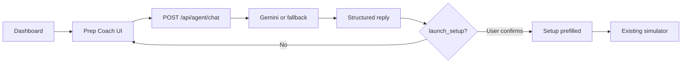

# Prep Coach — AI Agent Flow

Prep Coach is PrepWize’s **interview preparation agent**. It complements the existing interview simulator by helping users decide **what** to practice and **how** to configure the next session.

It does **not** replace `/api/interview/start`, `/api/interview/chat`, or `/api/interview/feedback`.

---

## Architecture

```
User (Dashboard → Coach UI)
  → POST /api/agent/chat
      { message, messages[], context{ profile, recentSessions[] } }
  → Gemini (gemini-3.5-flash, JSON schema)
      OR buildFallbackAgentResponse()
  ← { reply, suggestedAction? }
  → User reads reply; optional "Apply recommendation"
  → App navigates to Setup (prefilled InterviewPreferences)
  → User reviews/edits → existing handleLaunchSession → Simulator
```

Same-origin Express monolith; Gemini runs **server-side only** (`requireAuth`, rate limits, input sanitization).

---

## Input / context

| Field | Purpose |
|-------|---------|
| `message` | Current user question |
| `messages` | Prior coach conversation (`user` / `coach`) |
| `context.profile` | Name, plan, role, simulations completed, streak |
| `context.recentSessions` | Compact summaries (type, difficulty, role, score, strengths/weaknesses) — **not** full chat or code |

Client builds summaries from `localStorage` sessions in `InterviewCoachAgent.tsx`.

---

## Structured response

```typescript
{
  reply: string;                    // User-facing coaching text only
  suggestedAction?: {
    type: "launch_setup";
    preferences: InterviewPreferences;
    label?: string;
  };
}
```

No chain-of-thought or internal reasoning fields are exposed.

---

## Suggested actions

| Action | Behavior |
|--------|----------|
| `launch_setup` | Recommend `InterviewPreferences` for the existing Setup screen |

The simulator **does not** start automatically. The user must click **Apply recommendation**, review Setup, then **Generate Simulated Session** as before.

---

## User confirmation

1. Coach returns `suggestedAction` → UI shows recommendation card + **Apply recommendation**.
2. `App.tsx` sets `setupDraftPreferences` and `currentView = 'setup'`.
3. `SetupScreen` prefills fields via `initialPreferences`.
4. User launches interview through the normal flow.

---

## Relationship to the interview simulator

| Prep Coach | Interview simulator |
|------------|---------------------|
| Planning & coaching | Live mock interview |
| `/api/agent/chat` | `/api/interview/*` |
| Optional setup recommendation | Generates questions, chat, feedback |
| Uses history summaries | Uses full session state in simulator |

---

## Flow diagram



---

## Files

| File | Role |
|------|------|
| `src/types.ts` | Agent types |
| `server.ts` | `/api/agent/chat`, sanitization, fallback |
| `src/components/InterviewCoachAgent.tsx` | Chat UI |
| `src/App.tsx` | `coach` view + setup prefill |
| `src/components/Dashboard.tsx` | Entry: Ask Prep Coach |
| `src/components/SetupScreen.tsx` | `initialPreferences` |
